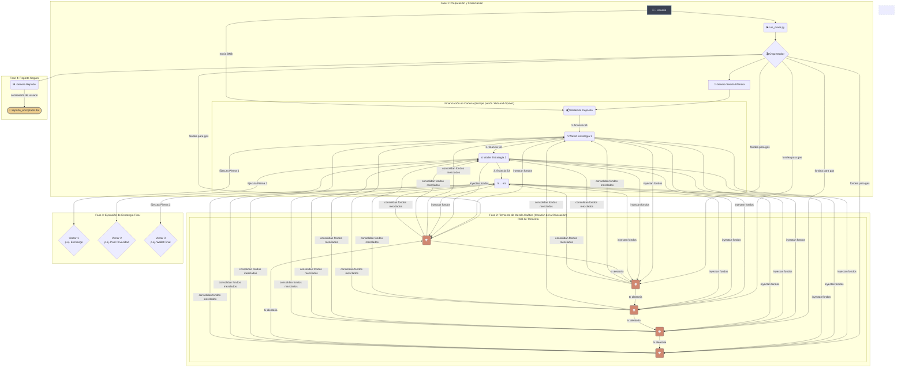

# Epic Mixer 🌪️
### Un Orquestador Experimental de Ofuscación de Transacciones Multi-Capa para BSC

[](https://www.python.org/downloads/)
[](https://opensource.org/licenses/MIT)


**Epic Mixer** es un framework de línea de comandos diseñado para la investigación avanzada y experimental de la privacidad en transacciones de blockchain. Funciona como un **orquestador** sofisticado, ejecutando estrategias definidas por el usuario para fragmentar y ofuscar los rastros de las transacciones en la Binance Smart Chain (BSC) a través de múltiples capas y sistemas.

---

## ⚠️ EXTREMADAMENTE IMPORTANTE: Esta es una Herramienta Experimental

**ÚSALA BAJO TU PROPIO E INMENSO RIESGO. ESTA NO ES UNA HERRAMIENTA PARA ACTIVIDADES ILEGALES. ES UN FRAMEWORK DE INVESTIGACIÓN.**

-   **Alto Riesgo de Pérdida de Fondos**: Este software es complejo y experimental. Una mala configuración, errores de red o bugs no descubiertos pueden y probablemente conducirán a la **pérdida total e irreversible de tus fondos**.
-   **Sin Garantías de Privacidad**: Aunque su objetivo es complicar drásticamente el análisis de transacciones, **no puede garantizar un anonimato absoluto**. Adversarios con suficientes recursos podrían rastrear los fondos.
-   **Solo para Fines Educativos y de Investigación**: Esta herramienta fue desarrollada para explorar conceptos de ofuscación de transacciones multi-sistema. Los desarrolladores no se hacen responsables de ningún uso, mal uso o pérdida de activos.

---

## 🏛️ Conceptos Clave y Arquitectura

Epic Mixer implementa un modelo de ofuscación avanzado que se puede dividir en cuatro fases principales, diseñadas para romper la trazabilidad y los patrones de análisis on-chain.

1.  **Modelo "Caja Fuerte" (No Custodial)**: No necesitas introducir tus claves privadas. El script genera una **sesión efímera** con una wallet de depósito de un solo uso. Simplemente envías los fondos a esta dirección para iniciar el proceso.
2.  **Financiación en Cadena (Chain Funding)**: Para evitar el patrón "hub-and-spoke" (un origen fondeando a muchos), que es fácilmente detectable, el mezclador utiliza una financiación en cadena. La wallet de depósito fondea a la primera wallet de estrategia (`S1`), `S1` fondea a `S2`, `S2` a `S3`, y así sucesivamente. Esto crea una cadena de transacciones que ofusca el origen común de los fondos.
3.  **Tormenta de Mezcla Caótica (Chaotic Mixing Storm)**: Este es el corazón de la ofuscación.
    *   **Pre-fondeo para Gas**: Antes de la tormenta, un conjunto de wallets de tormenta (`T1`, `T2`, etc.) son fondeadas con una pequeña cantidad de BNB para cubrir las tasas de gas.
    *   **Inyección y Mezcla**: Los fondos de las wallets de estrategia se envían a las wallets de tormenta. A continuación, se ejecuta un número configurable de rondas de transacciones, donde las wallets de tormenta se envían fondos entre sí de forma aleatoria (monto y destino).
    *   **Consolidación**: Tras la tormenta, los fondos (ahora mezclados) se consolidan de nuevo en las wallets de estrategia, listos para la distribución final.
4.  **Distribución Estratégica Multi-Vector**: Una vez mezclados los fondos, se ejecutan los "brazos" definidos en tu `strategy.json`, enviando los fondos a exchanges, pools de privacidad (simulados) o wallets finales.
5.  **Reporte Encriptado**: Todos los datos sensibles de la sesión (mnemónico, claves, etc.) se guardan en un archivo final encriptado con una contraseña que tú proporcionas.



---

## 📋 Requisitos

-   Python 3.9+

## 🚀 Instalación y Configuración

1.  **Clona el Repositorio**:
    ```bash
    git clone <URL_DE_TU_REPOSITORIO>
    cd epic-mixer
    ```

2.  **Crea un Entorno Virtual (Altamente Recomendado)**:
    ```bash
    python -m venv venv
    # En macOS/Linux:
    source venv/bin/activate
    # En Windows:
    venv\Scripts\activate
    ```

3.  **Instala las Dependencias**:
    ```bash
    pip install -r requirements.txt
    ```

4.  **Crea Tu Estrategia**:
    -   Copia el archivo de estrategia de ejemplo:
        ```bash
        cp strategy.json.example strategy.json
        ```
    -   **Edita `strategy.json`** para definir tu plan de ofuscación.

---

## ▶️ Modo de Uso

Todo el proceso se orquesta a través de la línea de comandos.

### Paso 1: Inicia el Mixer

Ejecuta el script desde el directorio raíz. Usa el flag `--network` para operaciones en la red principal (Mainnet).

```bash
# Para ejecutar en la Testnet SEGURA y GRATUITA (POR DEFECTO)
python run_mixer.py

# Para ejecutar en la Mainnet REAL y RIESGOSA
python run_mixer.py --network mainnet
```

### Paso 2: Deposita los Fondos

El script generará y mostrará una dirección de depósito única y de un solo uso, junto con un código QR. Envía los BNB que deseas procesar a esta dirección desde tu wallet segura o exchange. El script esperará y detectará el depósito automáticamente.

### Paso 3: Configura los Destinos

Una vez detectados los fondos, el script te guiará a través de una serie de preguntas basadas en tu archivo `strategy.json`:

-   Te pedirá que proporciones las direcciones de depósito para cualquier "brazo" de tipo `exchange`.
-   Te preguntará cuántas wallets finales deseas y sus direcciones.
-   Finalmente, te pedirá una **contraseña segura** para encriptar el archivo de reporte final.

### Paso 4: Ejecución y Reporte

Tras tu confirmación final, el orquestador ejecutará la estrategia. Al completarse, generará un archivo encriptado llamado `mixer_report_encrypted_...dat`.

---

##  Herramienta de Desencriptación (decryption-tool.py)

Para desencriptar y ver el reporte de tu sesión, necesitarás un script separado. Puedes crear un nuevo archivo `decryption-tool.py` y añadirle este código:
```python
import getpass
import json
from Crypto.Cipher import AES
from Crypto.Protocol.KDF import PBKDF2

SALT_SIZE = 16
NONCE_SIZE = 16
TAG_SIZE = 16
KEY_SIZE = 32

def decrypt_data(encrypted_data: bytes, password: str) -> dict:
    """Desencripta datos encriptados con AES-256-GCM."""
    try:
        salt = encrypted_data[:SALT_SIZE]
        nonce = encrypted_data[SALT_SIZE:SALT_SIZE + NONCE_SIZE]
        tag = encrypted_data[SALT_SIZE + NONCE_SIZE:SALT_SIZE + NONCE_SIZE + TAG_SIZE]
        ciphertext = encrypted_data[SALT_SIZE + NONCE_SIZE + TAG_SIZE:]

        key = PBKDF2(password, salt, dkLen=KEY_SIZE, count=1000000)
        cipher = AES.new(key, AES.MODE_GCM, nonce=nonce)

        decrypted_payload = cipher.decrypt_and_verify(ciphertext, tag)
        
        return json.loads(decrypted_payload.decode('utf-8'))
    except (ValueError, KeyError):
        raise ValueError("Error de desencriptación. Contraseña incorrecta o datos corruptos.")

def main():
    """CLI para desencriptar un reporte."""
    print("--- Desencriptador de Reportes Epic Mixer ---")
    file_path_input = input("Arrastra o pega la ruta al archivo .dat encriptado: ").strip()
    # Limpiar comillas si el usuario arrastra el archivo (común en Windows)
    file_path = file_path_input.replace("'", "").replace('"', '')
    
    try:
        with open(file_path, 'rb') as f:
            encrypted_data = f.read()
    except FileNotFoundError:
        print(f"❌ Error: Archivo no encontrado en la ruta: {file_path}")
        return
        
    password = getpass.getpass("🔑 Introduce la contraseña de la sesión: ")
    
    try:
        decrypted_report = decrypt_data(encrypted_data, password)
        print("\n--- ✅ Reporte Desencriptado ---")
        print(json.dumps(decrypted_report, indent=4))
        print("\n------------------------------")
    except ValueError as e:
        print(f"❌ Error: {e}")

if __name__ == "__main__":
    main()

## 🌟 SuperMixer v2: Características Avanzadas

- **Cross-Chain Bridges**: integración con cBridge y Stargate para mover fondos entre BSC, Polygon zkEVM, Arbitrum, etc.
- **DEX Swaps**: soporta PancakeSwap v3 y 1inch API para intercambiar activos y romper trazabilidad.
- **Ruido Inteligente**: micro-transacciones y llamadas a contratos populares (NFTs, staking) para camuflar actividad.
- **Planificación Temporal**: tareas programadas con APScheduler y ventanas de alta actividad para ofuscación temporal.
- **OpSec por Tor**: enruta las llamadas RPC a través de un proxy SOCKS5 (Tor) para ocultar la IP del usuario.
- **Failover Seguro**: mecanismo automático de recuperación y vault de emergencia si falla la orquestación.
- **Advanced Reporting**: genera pruebas Merkle y view-keys para compartir selectivamente partes del rastro.

### Uso con SuperMixer v2
1. Copia el ejemplo `strategy_v2.json.example` a `strategy.json` y edítalo con tus parámetros.
2. Asegúrate de tener corriendo un proxy Tor en `127.0.0.1:9050` para habilitar OpSec.
3. Ejecuta:
   ```bash
   python run_mixer.py --network testnet
   ```
4. Sigue las indicaciones: direcciones de destino, confirmación y contraseña para el reporte.
5. Al finalizar, obtendrás `mixer_report_encrypted_YYYYMMDD_HHMMSS.dat` y la raíz Merkle.

## 📄 Licencia

Este proyecto está bajo la Licencia MIT - consulta el archivo [LICENSE](LICENSE) para más detalles.
