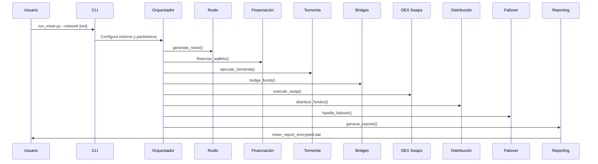

# 🌪️ Epic Mixer | SuperMixer v2

[] [] []()

> **SuperMixer v2** es un orquestador avanzado de ofuscación de transacciones on-chain, diseñado para maximizar la privacidad y resistencia al análisis en múltiples blockchains.

---

## 📋 Tabla de Contenidos
1. [Características Clave](#-características-clave)
2. [Arquitectura & Flujo](#-arquitectura--flujo)
3. [Instalación Rápida](#-instalación-rápida)
4. [Configuración de la Estrategia](#-configuración-de-la-estrategia)
5. [Uso](#-uso)
6. [Reporte Avanzado](#-reporte-avanzado)
7. [Desafío Educativo](#-desafío-educativo)
8. [Estructura del Proyecto](#-estructura-del-proyecto)
9. [Personalización Avanzada](#-personalización-avanzada)
10. [Variables de Entorno](#-variables-de-entorno)
11. [Depuración y Logs](#-depuración-y-logs)
12. [Testing](#-testing)
13. [Contribuir](#-contribuir)
14. [Licencia](#-licencia)

---

## 🚀 Características Clave
- **Puentes Cross-Chain**: cBridge y Stargate para mover fragmentos de fondos entre blockchains.
- **DEX Swaps**: PancakeSwap v3 y 1inch para romper patrones de volumen.
- **Generación de Ruido**: micro-transacciones y llamadas Dust a contratos populares.
- **Planificación Temporal**: APScheduler con retrasos aleatorios y ventanas de actividad.
- **OpSec Avanzado**: RPC vía Tor (SOCKS5) para anonimizar metadatos.
- **Failover Seguro**: vault de emergencia para recuperación automática de fondos.
- **Reporting Criptográfico**: cifrado AES-GCM + Merkle proofs + view-keys.

---

## 🏗️ Arquitectura & Flujo


---

## ⚙️ Instalación Rápida
```bash
# Clonar repositorio
git clone https://github.com/Falopp/mixer.git
cd mixer

# Crear y activar entorno virtual
python -m venv venv
# Windows
venv\\Scripts\\activate
# macOS/Linux
source venv/bin/activate

# Instalar dependencias
pip install -r requirements.txt
```

---

## 🔧 Configuración de la Estrategia
1. Copia `strategy_v2.json.example` a `strategy.json`.
2. Personaliza los campos:
   - `bridges`: cadenas y porcentajes.
   - `dex_swaps`: routers, paths y slippage.
   - `noise_profile`: número de micro-txs y contratos.
   - `storm`: wallets, rondas y delays.
   - `distribution`: tipo, porcentajes y direcciones.
   - `time_windows`: horarios activos y sesgo de fin de semana.
   - `emergency_vault_address` (opcional).

<details>
<summary>Ejemplo de <code>strategy.json</code></summary>

```json
{
  "bridges": [ /* ... */ ],
  "dex_swaps": [ /* ... */ ],
  "noise_profile": { /* ... */ },
  // ... otros campos ...
}
```
</details>

---

## 🏃 Uso
```bash
python run_mixer.py --network testnet
```
Sigue las instrucciones en pantalla para direcciones, contraseña y parámetros.

> Al finalizar, obtendrás:
> - `mixer_report_encrypted_<timestamp>.dat`
> - Merkle Root impreso en consola.

---

## 📈 Reporte Avanzado
- **Formato cifrado**: AES-GCM.
  - **Contenido**: detalles de sesión, transacciones (hashes) y `merkle_root`.

Para desencriptar:
```bash
python decryption-tool.py mixer_report_encrypted_<timestamp>.dat
```


## 📁 Estructura del Proyecto
```bash
mixer/
├─ epic_mixer/
│  ├─ bridges/
│  ├─ core/
│  ├─ dex/
│  ├─ utils/
│  ├─ noise_generator.py
│  ├─ scheduler.py
│  ├─ opsec.py
│  ├─ failover.py
│  └─ main.py
├─ tests/
│  ├─ unit/
│  └─ integration/
├─ run_mixer.py
├─ strategy_v2.json.example
├─ strategy.json
├─ README.md
└─ requirements.txt
```

---

## 🔄 Personalización Avanzada
Extiende el sistema creando nuevos adaptadores o plugins:
```python
from epic_mixer.bridges.base import BaseBridgeAdapter

class MiBridgeAdapter(BaseBridgeAdapter):
    name = "mi_bridge"
    async def bridge(self, web3, source_wallet, amount_wei, to_chain, dest_address):
        # Implementar lógica de puente
        return tx_hash
```

---

## ⚙️ Variables de Entorno
- `TOR_SOCKS_URL`: URL del proxy Tor (por defecto `socks5://127.0.0.1:9050`).
- `CUSTOM_RPC_URL`: URL de un nodo RPC alternativo.
- `LOG_LEVEL`: nivel de logging (`DEBUG`, `INFO`, `WARN`, `ERROR`).

---

## 📑 Roadmap
Consulta el plan de mejoras y estado actual en [ROADMAP.md](ROADMAP.md).

## 🧪 Testing
Ejecuta la suite de tests:
```bash
pytest --maxfail=1 --disable-warnings -v
```

## 🤖 CI/CD
Se ha integrado un workflow de GitHub Actions para análisis estático (Flake8, Pylint, Mypy, Bandit) en:
`.github/workflows/static-analysis.yml`.

## 🤝 Contribuir
1. Realiza un fork del repositorio.
2. Crea una rama `feat/...` o `fix/...` con tus cambios.
3. Asegúrate de pasar los tests y CI.
4. Envía un Pull Request describiendo tus cambios.

## 📜 Licencia
Este proyecto está bajo la licencia MIT. Consulta el archivo [LICENSE](LICENSE) para más detalles.
