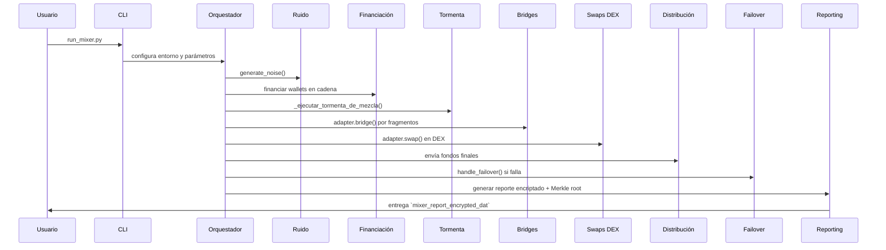

# Epic Mixer 🌪️ SuperMixer v2

**SuperMixer v2** es un orquestador de ofuscación de transacciones diseñado para maximizar la resistencia al análisis on-chain. Combina técnicas multi-capa: financiación en cadena, tormenta caótica, puentes cross-chain, swaps en DEX, generación de ruido, planificación temporal y reporting criptográfico.

## Índice
1. [Visión General](#visión-general)
2. [Módulos Principales](#módulos-principales)
3. [Flujo de Ejecución](#flujo-de-ejecución)
4. [Instalación](#instalación)
5. [Configuración de la Estrategia](#configuración-de-la-estrategia)
6. [Uso y Ejecución](#uso-y-ejecución)
7. [Reporte Avanzado y Desencriptación](#reporte-avanzado-y-desencriptación)
8. [Desafío Educativo](#desafío-educativo)
9. [Testing](#testing)
10. [Contribuir](#contribuir)
11. [Licencia](#licencia)

## Visión General
SuperMixer v2 transforma BNB (o cualquier activo ERC-20 adaptado) a través de una serie de fases:
- **1. Preparación**: generación de sesión efímera y derivación de wallets.
- **2. Ruido Pre-Mezcla**: micro-transacciones y dApps populares para camuflar actividad.
- **3. Financiación en Cadena**: rompe el patrón hub-and-spoke con transacciones escalonadas.
- **4. Tormenta Caótica**: mezcla de fondos entre wallets de tormenta con montos aleatorios.
- **5. Puentes Cross-Chain**: traslada fragmentos de fondos entre diferentes blockchains.
- **6. Swaps en DEX**: intercambia activos para interrumpir relación de tokens.
- **7. Distribución Final**: envía los fondos ofuscados a exchanges, pools o direcciones finales.
- **8. Failover**: si algo falla, recupera todos los fondos a una vault de emergencia.
- **9. Reporting Seguro**: genera un reporte encriptado con Merkle root y view-key.

## Módulos Principales
- **`core/`**: orquestación general (`orchestrator`, `wallets`, `web3_utils`).
- **`bridges/`**: adaptadores cBridge y Stargate para puentes cross-chain.
- **`dex/`**: adaptadores PancakeSwap y 1inch para swaps en DEX.
- **`noise_generator.py`**: micro-transacciones y llamadas "dust".
- **`scheduler.py`**: APScheduler para calendarizar fases con delays aleatorios.
- **`opsec.py`**: configuración de Web3 a través de Tor (SOCKS5).
- **`failover.py`**: recolección de fondos en vault en caso de fallo.
- **`utils/`**:
  - `config.py`: validación de `strategy.json`.
  - `reporting.py`: cifrado AES-GCM del reporte.
  - `advanced_reporting.py`: Merkle proofs y view-keys.

## Flujo de Ejecución


## Instalación
```bash
git clone <URL_REPOSITORIO>
cd mixer
python -m venv venv
# Windows
venv\Scripts\activate
# macOS/Linux
# source venv/bin/activate
pip install -r requirements.txt
```

## Configuración de la Estrategia
1. Copia `strategy_v2.json.example` a `strategy.json`.
2. Ajusta campos:
   - `bridges`, `dex_swaps`, `noise_profile`, `storm`, `distribution`, `time_windows`.
   - Opcional: `emergency_vault_address`.

## Uso y Ejecución
```bash
python run_mixer.py --network testnet
```
Sigue las indicaciones: exchange, wallets finales y contraseña.  
Al terminar, obtendrás:
- `mixer_report_encrypted_<timestamp>.dat`  
- Merkle root impreso en consola.

## Reporte Avanzado y Desencriptación
- **Reporte JSON**: incluye detalles de sesión, configuración y `tx_report` con hashes y `merkle_root`.
- **Desencriptar**:
  ```bash
  python decryption-tool.py mixer_report_encrypted_<timestamp>.dat
  ```

## Desafío Educativo
**$10,000 Epic Trace Challenge**: publica solo hash inicial y dirección.  
Participantes presentan:
- Camino de transacciones (hashes + direcciones).  
- Metodología y pruebas Merkle o view-keys.  
Ganador recibe premio en USDC.

## Testing
```bash
python -m pytest -q
```

## Contribuir
Pull requests e issues son bienvenidos. Utiliza Conventional Commits:
- `feat()`, `fix()`, `docs()`, `test()`, etc.

## Licencia
MIT © Epic Mixer Developers
