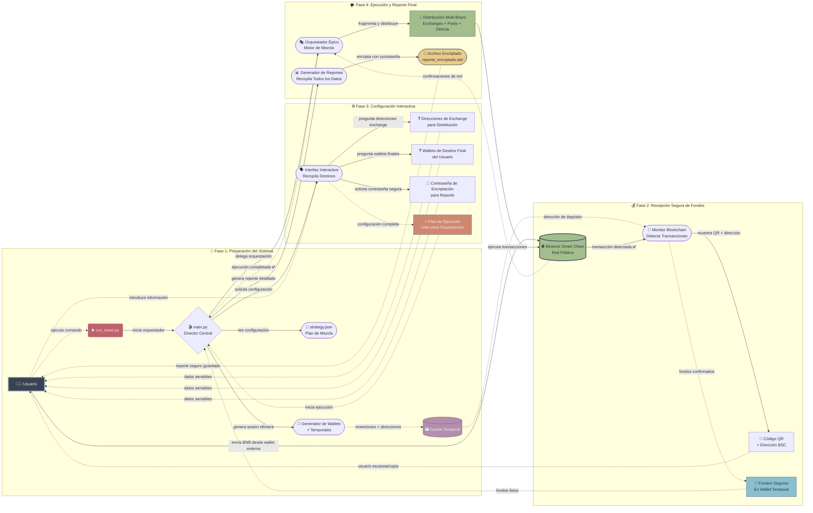

# Epic Mixer 🌪️
### Un Orquestador Experimental de Ofuscación de Transacciones Multi-Capa para BSC

[](https://www.python.org/downloads/)
[](https://opensource.org/licenses/MIT)


**Epic Mixer** es un framework de línea de comandos diseñado para la investigación avanzada y experimental de la privacidad en transacciones de blockchain. Funciona como un **orquestador** sofisticado, ejecutando estrategias definidas por el usuario para fragmentar y ofuscar los rastros de las transacciones en la Binance Smart Chain (BSC) a través de múltiples capas y sistemas.

---

## ⚠️ EXTREMADAMENTE IMPORTANTE: Esta es una Herramienta Experimental

**ÚSALA BAJO TU PROPIO E INMENSO RIESGO. ESTA NO ES UNA HERRAMIENTA PARA ACTIVIDADES ILEGALES. ES UN FRAMEWORK DE INVESTIGACIÓN.**

-   **Alto Riesgo de Pérdida de Fondos**: Este software es complejo y experimental. Una mala configuración, errores de red o bugs no descubiertos pueden y probablemente conducirán a la **pérdida total e irreversible de tus fondos**.
-   **Sin Garantías de Privacidad**: Aunque su objetivo es complicar drásticamente el análisis de transacciones, **no puede garantizar un anonimato absoluto**. Adversarios con suficientes recursos podrían rastrear los fondos.
-   **Solo para Fines Educativos y de Investigación**: Esta herramienta fue desarrollada para explorar conceptos de ofuscación de transacciones multi-sistema. Los desarrolladores no se hacen responsables de ningún uso, mal uso o pérdida de activos.

---

## 🏛️ Conceptos Clave y Arquitectura

Epic Mixer no es un simple "tumbler". Es un **orquestador** que tú diriges. La filosofía central es la **ofuscación multi-capa dirigida por estrategias**.

1.  **Dirigido por Estrategia**: Defines el plan de mezcla completo en un archivo `strategy.json`. Esto incluye el número de wallets, las rondas de mezcla y, lo más importante, los **brazos de distribución** (distribution legs).
2.  **Distribución Multi-Capa**: En lugar de un único destino, los fondos se fragmentan y se envían a través de múltiples "brazos", tales como:
    -   **Exchanges**: Una porción de los fondos puede ser enviada a una dirección de depósito que tú proporciones de un exchange externo.
    -   **Pools de Privacidad (Simulado)**: Una porción puede ser enviada a una wallet intermediaria para simular la interacción con un protocolo de privacidad como Tornado Cash.
    -   **Fragmentación Directa**: El resto puede ser distribuido directamente a tus wallets de destino finales.
3.  **No Custodial y Efímero**: La herramienta opera bajo un modelo de "Caja Fuerte". Genera un nuevo mnemónico efímero y una dirección de depósito para cada sesión. **Nunca introduces tus claves privadas.** Envías los fondos *a* la wallet temporal del script.
4.  **Reportes Encriptados**: Al finalizar, todos los datos de la sesión, incluyendo el mnemónico efímero y las claves privadas generadas, se guardan en un archivo encriptado con contraseña. Sin la contraseña, los datos son inútiles.



---

## 📋 Requisitos

-   Python 3.9+

## 🚀 Instalación y Configuración

1.  **Clona el Repositorio**:
    ```bash
    git clone <URL_DE_TU_REPOSITORIO>
    cd epic-mixer
    ```

2.  **Crea un Entorno Virtual (Altamente Recomendado)**:
    ```bash
    python -m venv venv
    # En macOS/Linux:
    source venv/bin/activate
    # En Windows:
    venv\Scripts\activate
    ```

3.  **Instala las Dependencias**:
    ```bash
    pip install -r requirements.txt
    ```

4.  **Crea Tu Estrategia**:
    -   Copia el archivo de estrategia de ejemplo:
        ```bash
        cp strategy.json.example strategy.json
        ```
    -   **Edita `strategy.json`** para definir tu plan de ofuscación.

---

## ▶️ Modo de Uso

Todo el proceso se orquesta a través de la línea de comandos.

### Paso 1: Inicia el Mixer

Ejecuta el script desde el directorio raíz. Usa el flag `--network` para operaciones en la red principal (Mainnet).

```bash
# Para ejecutar en la Testnet SEGURA y GRATUITA (POR DEFECTO)
python run_mixer.py

# Para ejecutar en la Mainnet REAL y RIESGOSA
python run_mixer.py --network mainnet
```

### Paso 2: Deposita los Fondos

El script generará y mostrará una dirección de depósito única y de un solo uso, junto con un código QR. Envía los BNB que deseas procesar a esta dirección desde tu wallet segura o exchange. El script esperará y detectará el depósito automáticamente.

### Paso 3: Configura los Destinos

Una vez detectados los fondos, el script te guiará a través de una serie de preguntas basadas en tu archivo `strategy.json`:

-   Te pedirá que proporciones las direcciones de depósito para cualquier "brazo" de tipo `exchange`.
-   Te preguntará cuántas wallets finales deseas y sus direcciones.
-   Finalmente, te pedirá una **contraseña segura** para encriptar el archivo de reporte final.

### Paso 4: Ejecución y Reporte

Tras tu confirmación final, el orquestador ejecutará la estrategia. Al completarse, generará un archivo encriptado llamado `mixer_report_encrypted_...dat`.

---

##  Herramienta de Desencriptación (decryption-tool.py)

Para desencriptar y ver el reporte de tu sesión, necesitarás un script separado. Puedes crear un nuevo archivo `decryption-tool.py` y añadirle este código:
```python
import getpass
import json
from Crypto.Cipher import AES
from Crypto.Protocol.KDF import PBKDF2

SALT_SIZE = 16
NONCE_SIZE = 16
TAG_SIZE = 16
KEY_SIZE = 32

def decrypt_data(encrypted_data: bytes, password: str) -> dict:
    """Desencripta datos encriptados con AES-256-GCM."""
    try:
        salt = encrypted_data[:SALT_SIZE]
        nonce = encrypted_data[SALT_SIZE:SALT_SIZE + NONCE_SIZE]
        tag = encrypted_data[SALT_SIZE + NONCE_SIZE:SALT_SIZE + NONCE_SIZE + TAG_SIZE]
        ciphertext = encrypted_data[SALT_SIZE + NONCE_SIZE + TAG_SIZE:]

        key = PBKDF2(password, salt, dkLen=KEY_SIZE, count=1000000)
        cipher = AES.new(key, AES.MODE_GCM, nonce=nonce)

        decrypted_payload = cipher.decrypt_and_verify(ciphertext, tag)
        
        return json.loads(decrypted_payload.decode('utf-8'))
    except (ValueError, KeyError):
        raise ValueError("Error de desencriptación. Contraseña incorrecta o datos corruptos.")

def main():
    """CLI para desencriptar un reporte."""
    print("--- Desencriptador de Reportes Epic Mixer ---")
    file_path_input = input("Arrastra o pega la ruta al archivo .dat encriptado: ").strip()
    # Limpiar comillas si el usuario arrastra el archivo (común en Windows)
    file_path = file_path_input.replace("'", "").replace('"', '')
    
    try:
        with open(file_path, 'rb') as f:
            encrypted_data = f.read()
    except FileNotFoundError:
        print(f"❌ Error: Archivo no encontrado en la ruta: {file_path}")
        return
        
    password = getpass.getpass("🔑 Introduce la contraseña de la sesión: ")
    
    try:
        decrypted_report = decrypt_data(encrypted_data, password)
        print("\n--- ✅ Reporte Desencriptado ---")
        print(json.dumps(decrypted_report, indent=4))
        print("\n------------------------------")
    except ValueError as e:
        print(f"❌ Error: {e}")

if __name__ == "__main__":
    main()

## 📄 Licencia

Este proyecto está bajo la Licencia MIT - consulta el archivo [LICENSE](LICENSE) para más detalles.
