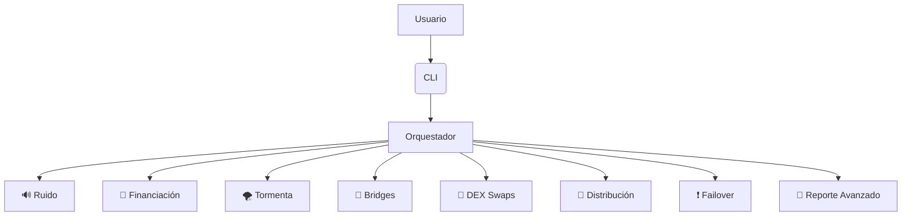

# Epic Mixer 🌪️ SuperMixer v2

[](https://www.python.org/downloads/)
[](LICENSE)
[]

Epic Mixer SuperMixer v2 es un **orquestador avanzado** de ofuscación de transacciones on-chain, diseñado para investigación, educación y competencias de privacidad en múltiples blockchains. Integra puentes cross-chain, DEX swaps, generación de ruido, planificación temporal y reporting criptográfico para maximizar la resistencia al análisis.

## Contenidos
- [Características](#características)
- [Arquitectura](#arquitectura)
- [Instalación](#instalación)
- [Estrategia (`strategy.json`)](#estrategia-strategyjson)
- [Uso y Ejecución](#uso-y-ejecución)
- [Reporte Avanzado](#reporte-avanzado)
- [Desafío Educativo](#desafío-educativo)
- [Testing](#testing)
- [Contribuir](#contribuir)
- [Licencia](#licencia)

## Características
1. **Cross-Chain Bridges**: cBridge y Stargate para mover fondos entre BSC, Polygon zkEVM, Arbitrum, etc.
2. **DEX Swaps**: PancakeSwap v3 y 1inch API para intercambiar activos y romper patrones de volumen.
3. **Ruido Inteligente**: micro-transacciones y llamadas a contratos populares (NFTs, staking) para camuflar actividad.
4. **Planificación Temporal**: APScheduler para calendarizar fases con delays aleatorios y ventanas de alta actividad.
5. **OpSec / RPC por Tor**: enruta todas las llamadas RPC a través de SOCKS5 (Tor) para anonimizar metadatos.
6. **Failover Seguro**: recolección automática de fondos en vault de emergencia si ocurre un fallo crítico.
7. **Advanced Reporting**: cifrado AES-GCM, Merkle proofs y view-keys para revelación selectiva de trazas.

## Arquitectura

```mermaid
graph TD
  U[Usuario] --> CLI(CLI)
  CLI --> ORQ[Orquestador]
  ORQ --> NOISE[🔊 Ruido]
  ORQ --> FUND[🔗 Financiación]
  ORQ --> STORM[🌪️ Tormenta]
  ORQ --> BRIDGES[🔀 Bridges]
  ORQ --> DEX[🔄 DEX Swaps]
  ORQ --> DIST[🚀 Distribución]
  ORQ --> FAIL[❗ Failover]
  ORQ --> REP[📄 Reporte Avanzado]
```  

## Instalación
```bash
git clone <URL_REPOSITORIO>
cd mixer
python -m venv venv
# Windows
env\Scripts\activate
# macOS/Linux
# source venv/bin/activate

pip install -r requirements.txt
```

## Estrategia (`strategy.json`)
Copia `strategy_v2.json.example` a `strategy.json` y personaliza:
- **bridges**: nombre, cadenas origen/destino y `amount_pct`.
- **dex_swaps**: `router`, `path`, `slippage`.
- **noise_profile**: `n_micro_txs`, `contract_pool`.
- **storm**: `wallets`, `mixing_rounds`, `gas_amount_bnb`, `time_delay_sec`.
- **distribution**: `type` (`exchange`, `direct_distribution`), `amount_pct`, `destination_address`.
- **time_windows**: `active_hours`, `weekend_bias`.
- **emergency_vault_address** (opcional).

Ejemplo:
```json
${LITERAL strategy_v2.json.example}
```

## Uso y Ejecución
1. Asegúrate de tener Tor en `127.0.0.1:9050` (para OpSec).
2. Ejecuta:
   ```bash
   python run_mixer.py --network testnet
   ```
3. Sigue las indicaciones: direcciones de exchange, wallets finales y contraseña.
4. Al finalizar, recibirás:
   - `mixer_report_encrypted_<timestamp>.dat` (reporte cifrado).
   - En consola, la raíz Merkle asociada a las transacciones.

## Reporte Avanzado
El reporte JSON incluye:
- `session_details`: mnemónico, dirección de depósito y monto.
- `strategy_used`: configuración completa.
- `tx_report`: hashes de puentes y swaps, y `merkle_root`.

Para desencriptar:
```bash
python decryption-tool.py <ruta_al_dat>
```

## Desafío Educativo
**$10,000 Epic Trace Challenge**: publica únicamente hash inicial y dirección.
Participantes deben presentar:
- Caminos de transacciones (hash + direcciones).
- Metodología reproducible (scripts o gráficos).
- Pruebas Merkle o view-keys.

## Testing
```bash
python -m pytest -q
```

## Contribuir
Pull requests e issues son bienvenidos. Sigue Conventional Commits:
- `feat()`, `fix()`, `docs()`, `test()`.

## Licencia
Este proyecto está bajo licencia **MIT**. Consulta `LICENSE` para más detalles.
